# Git

Git has become the overwhelming industry standard for version control in software development. Whether the use case for Git is individual productivity or teamwork collaboration, it is used ubiquitously in projects.

**For Collaboration:**
1. **Seamless Teamwork:** Git allows multiple developers to work on the same codebase simultaneously without overwriting each other's changes. Each person can work on their own "branch" of the project, and then these individual contributions can be merged together.
I created this documentation for myself and others as it covers the basics to advanced Git topics.

2. **Code Review and Feedback:** Platforms built on Git (like GitHub, GitLab, Bitbucket) facilitate pull requests (or merge requests). This allows team members to review each other's code, suggest improvements, and ensure code quality before changes are integrated into the main project.

**For Individuals:**
1. **Version Control and History:**: Git meticulously tracks every change made to your files. You can see who made what change, when, and why (if good commit messages are used). This detailed history is invaluable for understanding how a project evolved.

2. **Undo Mistakes (Time Machine for Code:)** If you introduce a bug, make a bad design decision, or simply want to revert to a previous working state, Git allows you to easily "go back in time" to any point in your project's history. This safety net encourages experimentation without fear of breaking things permanently.

## Git Init and Hidden Folder
### `git init`: The Birth of a Git Repository
The `git init` command is the very first step you take when you want to start tracking a project (directory/folder) with Git. It's how you tell Git, "Hey, I want to manage this directory and its contents using version control."

Here was have a folder called `gitlearn` that contains `gitone`, `gittwo`, and `gitthree` as subdirectories for my examples

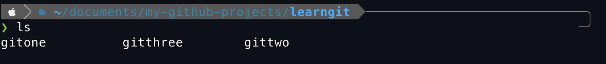

Let's go into `gitone` as the folder we want to start version controling

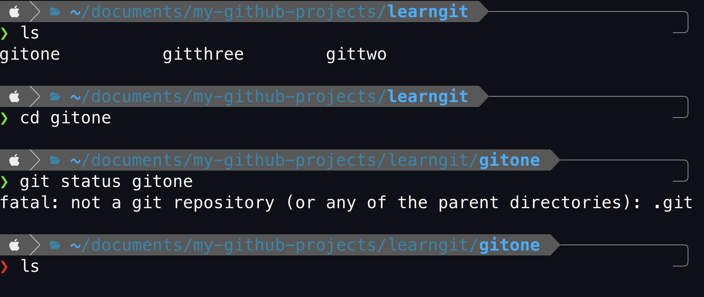

By using `git status`, it confirms that we are not currently in a Git repository, and therefore it's safe to proceed with `git init`. 

> **Question:** But before we do `git init`, how does `git status` know that `gitone` isn't a Git repository? After all, `gitone` looks like an empty folder. It knows because there isn't a `.git` (hidden) file inside of `gitone`. Once we `git init`, Git will create the `.git` file

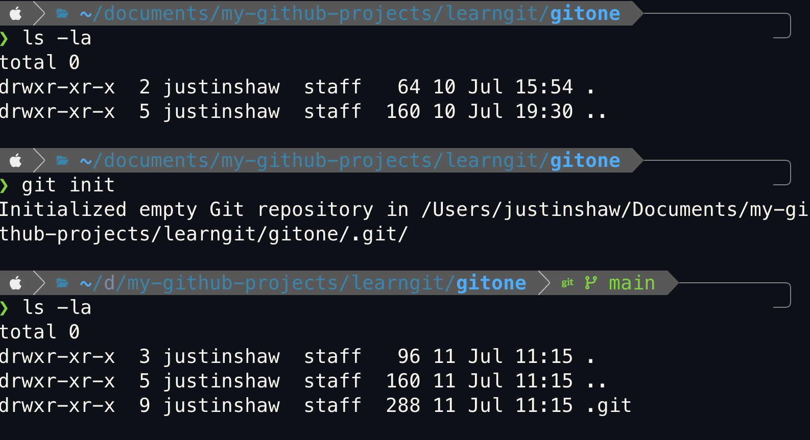

> **Note:** `ls -la`  provides a comprehensive, detailed list of ALL files and directories (including hidden ones) within the current directory. After `git init` we can see that a hidden file inside `gitone` has been created.

The `.git `folder is the **heart and soul of a Git repository**. It's a hidden directory that Git creates when you initialize a new repository (`git init`) or clone an existing one (g`it clone`). without it, all the necessary information and history for Git to manage your project's version control wouldn't be possible

## Git Add, Commints and Logs
### `git add`: Staging Changes for Commit
Now, we add two files into `gitone`, `textone.txt` and `texttwo.txt`. By using `git status` we can tell that these files are not being tracked by git. But how can we do that?

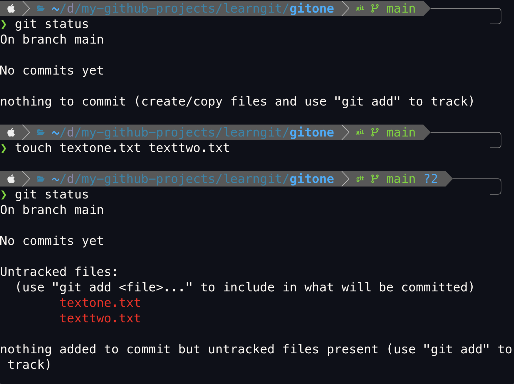

`git add` takes the changes from our working directory (in this case, `gitone`) and moves them to the staging area (also known as the "index"). The staging area acts as a temporary buffer or a "draft" for the next commit. That simple.

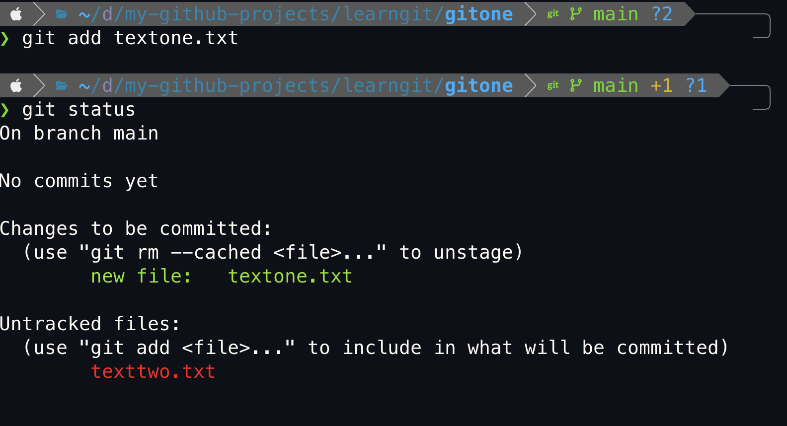

### `git commit`: Locking in Code Changes
`git commit` takes all the changes staged with `git add` and creates a permanent, immutable snapshot of the project at that moment, complete with a unique ID and descriptive message. This action officially records the progress, adding it to the repository's historical timeline.

We see below that `testtwo.txt` did not get commited into the repo as it was not part of `git add` staging process.

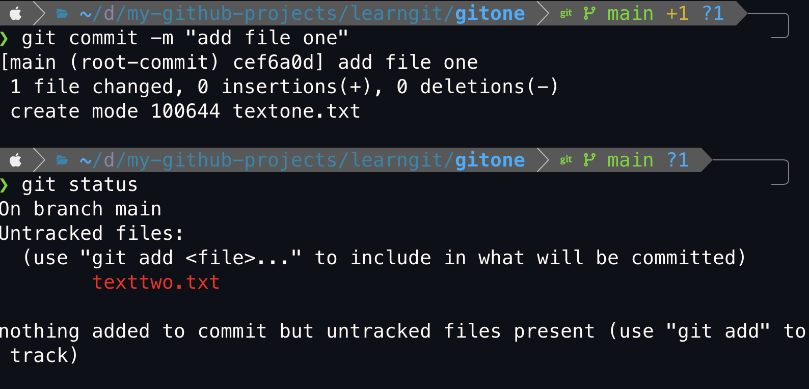

### `git log`: Tracing Every Step in The Repository's History
`git log` views the history of commits in the repository. It essentially shows a detailed record of every "save point" (git commit) that has been made, giving  valuable insight into how the project has evolved.

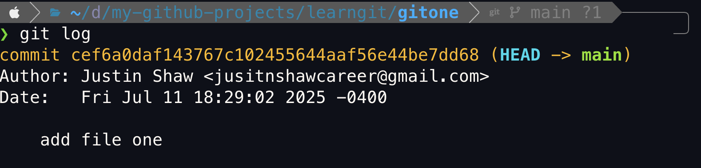

## Git Internal Workings and Configs
### `git config`: Setting Username & Email in Git
Notice in the image above, Git knows our name and even email in the logs. How is this possible? Well it's because the `~/.gitconfig` file.

```
# Updating our ~/.gitconfig file
git config --global user.name "Your Name"
git config --global user.email "your.email@example.com"
```

### `.gitignore`: Ignoring Files and Directories in Git

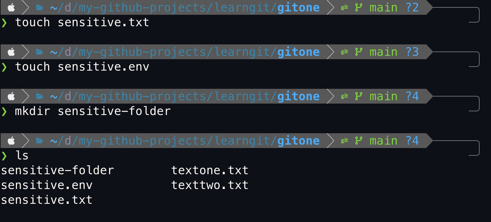
In `gitone`, I have created 2 files and 1 folder that cannot be commited due to the private contents (hypothetically in this case). How can we be safe that they are never commited?

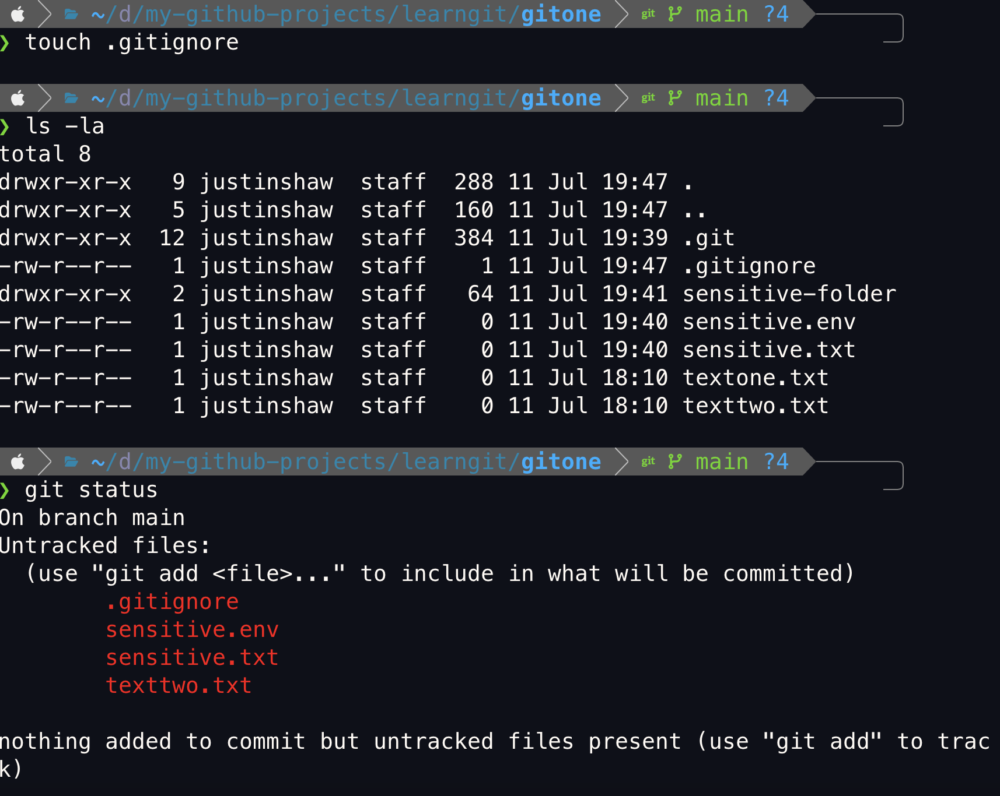

```
# Write inside .gitignore
.env
sensitive.txt
sensitive-folder/
```

By writing the files and folders I don't want to add and commit inside `.gitignore`, we can see it does not come up as an option anymore for tracking (seen with `git status`)

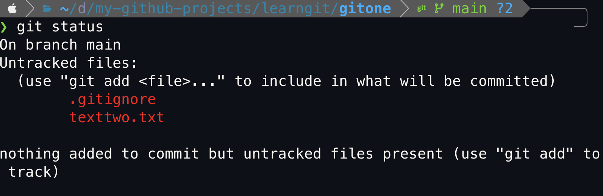

For big projects, `.gitignore` templates can be found on [gitignore.io](https://www.toptal.com/developers/gitignore)

## Git Branch, Merge, and Conflicts
### `git branch`: Navigating Parallel Development

`git branch` provides a powerful, flexible, and efficient way to manage changes in a project, enabling individual experimentation, seamless team collaboration, and effective management of different development lines and releases.

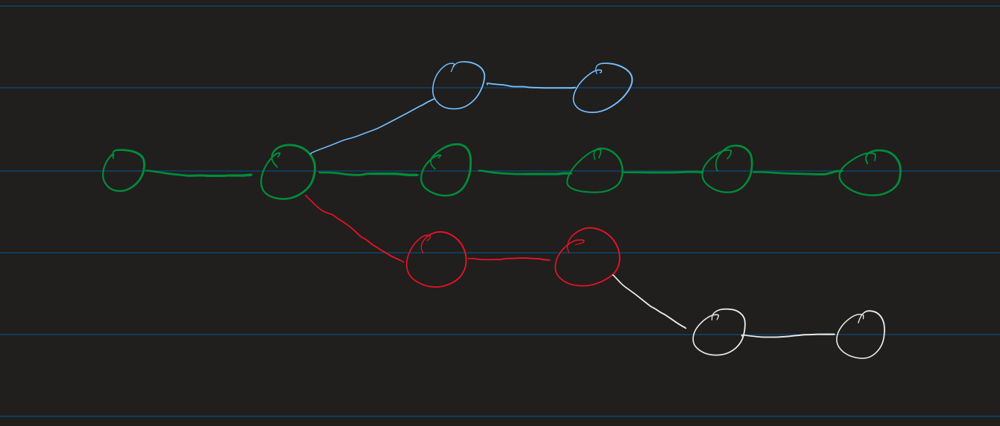

For this section, we will now be working with the `gittwo` folder and explain how `git branch` works. Inside `gittwo` will be a commited `index.html` folder. Below, I wont show how I did that as it should be trivial now.

Now inside `index.html`, add text that looks like this:
```html
<!DOCTYPE html>
<html lang="en">
<head>
    <meta charset="UTF-8">
    <meta name="viewport" content="width=device-width, initial-scale=1.0">
    <title>git learning</title>
</head>
<body>
    looks good as a project
</body>
</html>
```
And commit `index.html` again

#### How to create and move onto another branch?
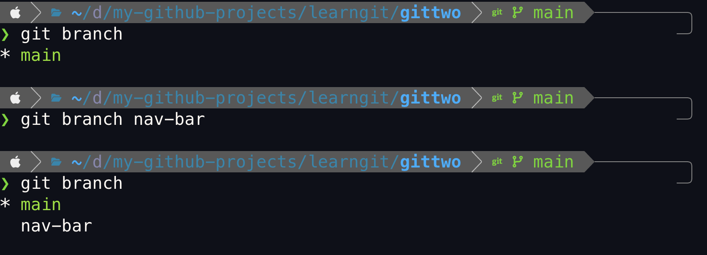

As seen above, `git branch BRANCH NAME` can be used to create a branch within Git. However, our pointer (*) is still pointing onto main. How can be move it?


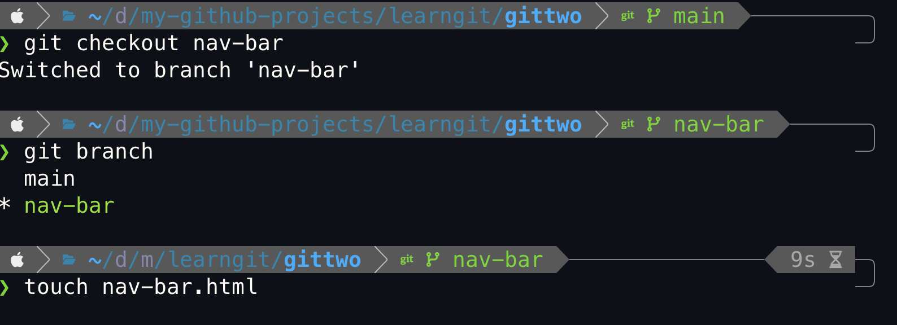

with `git checkout BRANCH NAME` we can simply move the point to `nav-bar`. After this add the code below into `nav-bar.html` and commit it to the branch (make sure the pointer is on `nav-bar`)

```html
<nav>
    <ul>
        <li>home</li>
        <li>about us</li>
        <li>contact us></li>
    </ul>
</nav>
```
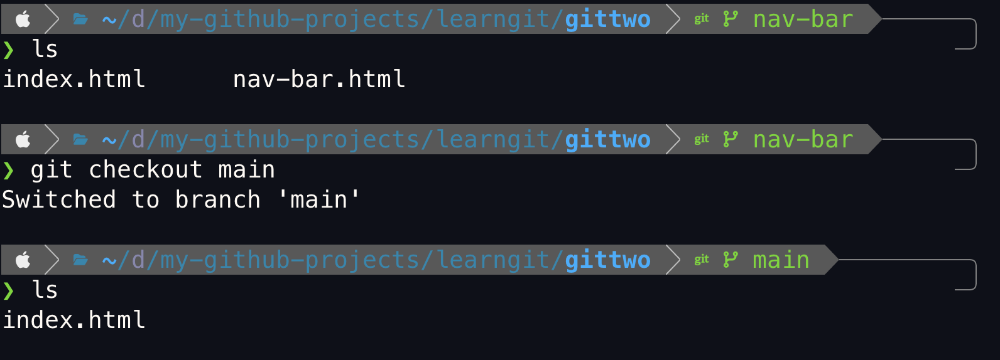

That is so cool! when we moved to the `main` branch we don't have `nar-bar.html` because that is in it's own branch, `nav-bar`.

Now since we are in the `main` branch, create a file `hero-section.html` and copy, paste and commit the code below.

```html
<section>
  <h1>Lorem ipsum dolor sit amet,
    consectetur adipisicing elit. Fugiat,
    sint.</h1>
  <p>Lorem ipsum dolor sit amet
    consectetur adipisicing elit. Nisi
    eaque, ullam eos laborum adipisci
    asperiores itaque delectus esse
    aperiam ex.</p>
</section>
```

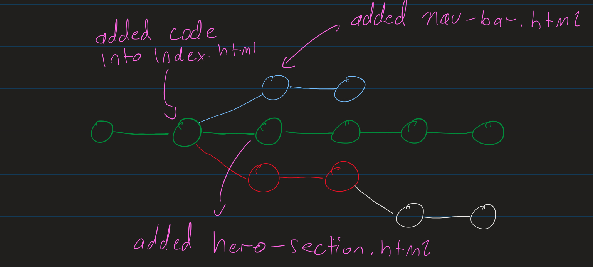

> **NOTE:** It is good practice to commit before swtiching to another branch. Also see shortcuts below
```
git branch -c BRANCH NAME
# or
git switch -b BRANCH NAME
# Will create the branch but also move your there at the same time.
``` 

### `git merge`: Integrating Divergent Lines of Development
We have `hero-section.html` in the `main` branch and `nav-bar.html` in the `nav-bar` branch, but how can we make it so that `main` can also have `nav-bar.html` from `nav-bar`? 

We can use `git merge` as it's used to combine independent lines of development into a single, unified history.

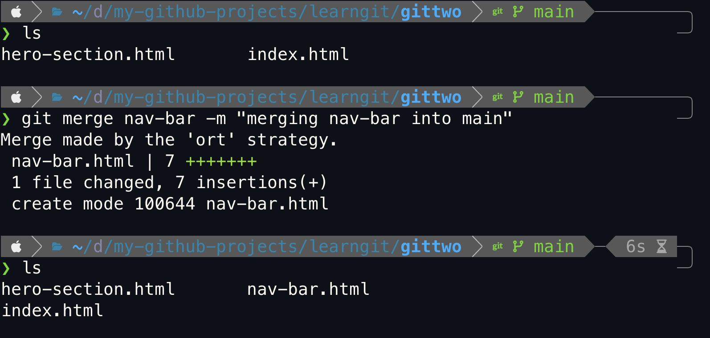

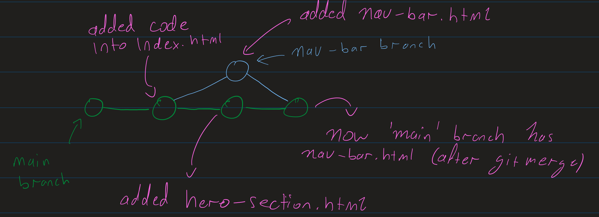

> **NOTE:** It is good practice to delete the branch after merging it with `main`. We can simply do with with `git branch -d BRANCH NAME` 

#### Resolving Git Conflicts: Merging Collision
A merge conflict is a situation where Git can't figure out which version of a particular piece of code or file to keep because both branches you're trying to merge have made **different changes to the same lines in a file**, or one branch has deleted a file that the other branch has modified.

In this example, we will create a new branch called `footer` (git checkout -b footer) and change the contents of `index.html` 

```html
# Add this to the body 
<body>
    looks good as a project

    changes made here (footer branch)
</body>
```

Commit the chagnes. Similarly make changes and commit the `index.html` file in `main`.

```html
# Add this to the body
<body>
    looks good as a project

    changes made (main branch)
</body>
```

Now let's merge `index.html` in `main` and `index.html` in `footer`. There will obviously a conflict but let's see how to deal with that.

We get this when we try to merge the branchs
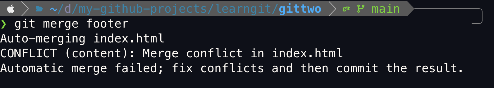

And on VSCode, we get this change in `index.html` file. Git doesn't know which one to keep, so it stops the merge and asks us to manually resolve the conflict.
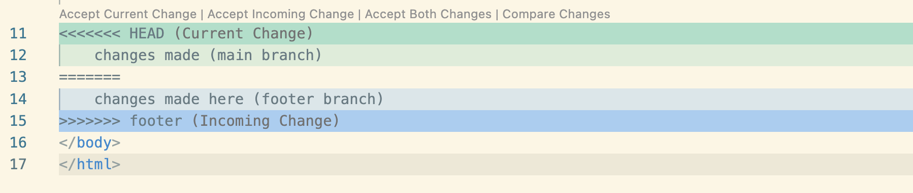

Depending on what we need, we can select what change we want in the top bar.

## Git Diff and Stashing
### `git diff`: Understanding Code Modifications
Shows the differences between various states of your repository. It helps see exactly what changes are made, what changes are staged for a commit, or what changes exist between different commits or branches.

#### Understanding `--- a/file` and `+++ b/file`
- `--- a/path/to/file`: This line represents the original version of the file, or the "before" state. The `a/` prefix is a convention used by Git to denote the "source" or "old" version of the file being compared.

- `+++ b/path/to/file`: This line represents the new version of the file, or the "after" state. The `b/` prefix is a convention used by Git to denote the "destination" or "new" version of the file being compared.

`a` typically refers to the state of the file in the staging area (what's been git added, or the last committed version if nothing is staged), and `b` refers to the current state of the file in your working directory (what you're currently editing).

#### Example
in `main`, change the `index.html` body to have this contents. Then `git add .` it :
```html
# BEFORE
<!DOCTYPE html>
<html lang="en">
<head>
    <meta charset="UTF-8">
    <meta name="viewport" content="width=device-width, initial-scale=1.0">
    <title>git learning</title>
</head>
<body>
    looks good as a project

    changes made (main branch)
</body>
</html>
```
```html
# AFTER 
<!DOCTYPE html>
<html lang="en">
<head>
    <meta charset="UTF-8">
    <meta name="viewport" content="width=device-width, initial-scale=1.0">
    <title>git learning</title>
</head>
<body>
    I would love add nav bar here

    project looks good

    changes made (main branch)
</body>
</html>
```
When we do `git diff --staged`, we can see the changes that have been made to `index.html`
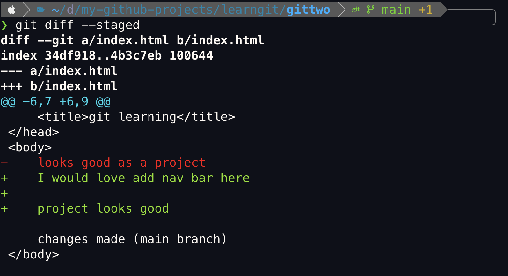


### `git stash`: Temporarily Saving Uncommitted Changes
when we have changes in your working directory (files modified or staged) that are not  ready to commit yet, but you need a clean working directory to do something else such as which to another branch.

#### Example
Create a new branch with `git checkout -b bugfix`. Within `index.html` we add this to the body
```html
<body>
    I would love add nav bar here

    project looks good

    changes made (main branch)

    *working on bug fix here*
</body>
```
In this scenario, what if we need to switch onto another branch such as `main` while working on the `bugfix` branch? This is where `git stash` is used.

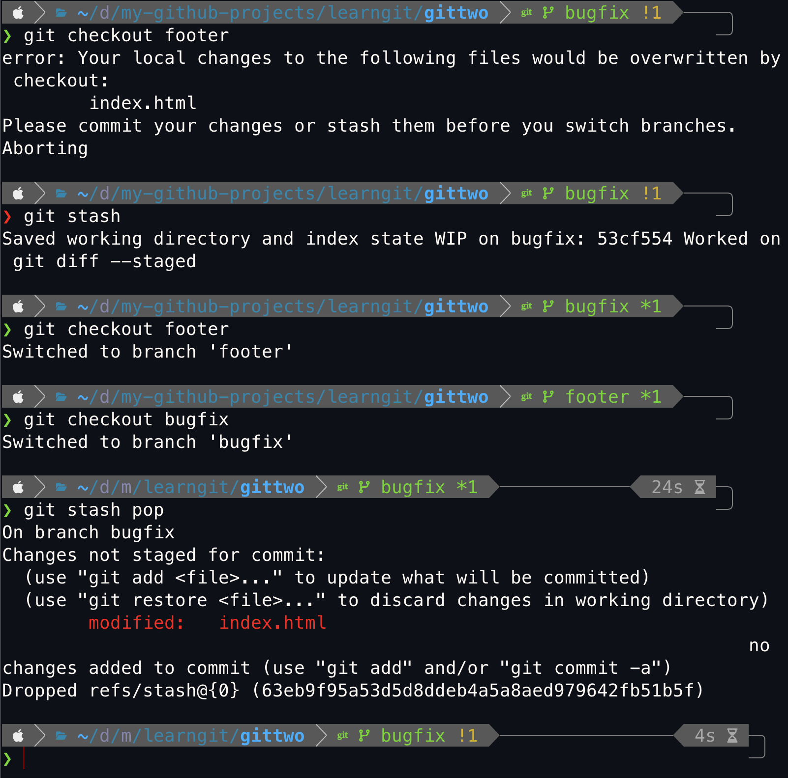
Once `git stash` has been used, we can move to other branchs freely. `git stash pop` is used to unstash.

> NOTE: use `git stash list` to see all the stashs that have been made

## Pushing Code to GitHub
### The newer way
Using the GitHub CLI locally on my machine is the easiest way I have found so far. 

### (ADD COMMANDS HERE LATER)

### The older way
for this demo, I created a practice repo called `git-test`. Once created, it shows a page like this.

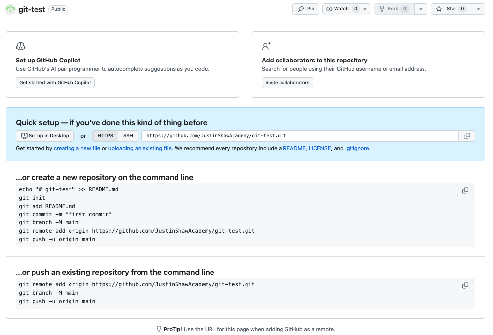

In most of the CLI commands below, we got to understand what they do.
```
echo "# git-test" >> README.md
git init
git add README.md
git commit -m "first commit"
git branch -M main
git remote add origin https://github.com/JustinShawAcademy/git-test.git
git push -u origin main
```

`git remote add <name> <URL>`:  This command is used to add a new **remote repository** to your local Git repository.
- `<name>`: This is a short, memorable name for the remote repository. This name acts as an alias for the full URL.
- `<URL>`: This is the actual URL of the remote repository (e.g., https://github.com/username/repo.git) 

Example: `git remote add origin https://github.com/myuser/myrepo.git`.
This command tells your local repository, "Hey, there's a remote repository at https://github.com/myuser/myrepo.git, and from now on, I'll refer to it as origin."

> **NOTE:** `git remove -v` lists the remote repositories that are configured onto the current local Git repository, and for each remote, it shows the URL(s) that Git uses for both fetching (downloading) and pushing (uploading) operations.

`git push -u origin main` (`git push --set-upstream origin main`) does two important thigns
1. Pushes your local main branch to the origin remote
2. Sets the upstream (tracking) branch for your local main branch

> **NOTE:** What does "setting the upstream branch" mean? In the future, when you are on your local main branch, you can simply type git push (without specifying origin main) and Git will automatically know to push your changes to origin/main. Similarly, git pull will automatically pull changes from origin/main.
